# 🎬 CineRec AI - Intelligent Cinematic Reel Orchestrator

CineRec AI is an enterprise-grade, high-performance multimedia orchestration platform that automatically ingests long-form movies and video files, analyzes their narrative and dialogue emotional intelligence, ranks the cinematic importance of individual scenes, and programmatically edits, matches background music, and composes stunning short-form reels (e.g., 60-second highlight reels) on an asynchronous distributed worker stack. 

Additionally, CineRec AI features a semantic video and catalog recommendation engine, allowing users to query natural language "vibe descriptions" to discover matched entries from a high-dimensional vector space.

---

## 🎯 Purpose of the Project

In the modern digital landscape, short-form video formats (such as TikTok, YouTube Shorts, and Instagram Reels) drive massive audience engagement. However, manually scrubbing through hours of video, slicing narrative peaks, finding royalty-free music of the correct matching mood, overlaying and synchronizing the soundtrack, and rendering the final output is a labor-intensive process.

**CineRec AI solves this problem by using a multi-stage Machine Learning and Computer Vision pipeline:**
- **Automated Scene Segmentation:** Rather than relying on simple temporal cuts, CineRec AI analyzes narrative cues and subtitle alignment to identify contextual scene boundaries.
- **Narrative Sentiment Analysis:** A custom-trained Transformer classifier evaluates dialogue emotional intensity to segment the film by emotional arcs.
- **AI-Driven Highlighting:** A Machine Learning ranker predicts the cinematic importance of segments to selectively extract only the most captivating scenes.
- **Synthesized Composition:** High-speed FFmpeg slicing and MoviePy audio-video merging dynamically assemble polished cinematic reels, lowering production turnaround times from hours to seconds.

---

## 🚀 Key Functionalities

1. **Workspace Project Management:** Create isolated production workspaces to organize specific movie catalogs, soundtrack assets, and generated reels.
2. **Direct-to-S3 Chunked Media Ingestion:** Upload bulk high-definition `.mp4` video files and synchronized `.srt` subtitle files directly to S3-compatible cloud storage buckets.
3. **Machine Learning Narrative Intelligence:**
   - Detects and tracks 6 core cinematic emotional themes: *Action, Suspense, Emotional, Comedy, Dark, and Motivational*.
   - Ranks movie segments by their visual/textual significance to avoid filler content.
4. **Automated Audio-Video Sync & Synthesis:**
   - Automatically matches extracted scene clips with background music of the exact matching mood.
   - Normalizes audio track length, stitches clips with premium transitions, overlays dynamic background music, and renders standard `H.264` multi-platform compatible `.mp4` media files at `24 FPS`.
5. **Real-time Queue & Progress Tracking:** Track composition tasks dispatched to Celery background workers with real-time status updates (*parsing subtitles, analyzing emotions, extracting clips, matching music, rendering reel, completed*).
6. **In-Browser Video Playback:** Instant streaming of fully rendered high-production reels using secure, temporary, pre-signed download URLs.
7. **Semantic Vector Search Recommendation:** Describe a specific movie "vibe" (e.g., *"a dark psychological thriller set in outer space with retro-futuristic music"*) and instantly query vector embeddings of movie catalogs to fetch semantic recommendations.

---

## 🧠 The ML Models and Architecture

CineRec AI relies on a sophisticated collection of local deep learning, machine learning, and semantic models orchestrated dynamically by the `MLOrchestrator` service layer:

### 1. Scene Emotion Classifier (Model 2)
* **Location:** `models/scene_emotion_classifier`
* **Architecture:** Hugging Face Transformer / PyTorch `Safetensors` Text Classification Model.
* **Key Files:** `model.safetensors`, `config.json`, `tokenizer.json`, `vocab.txt`.
* **Purpose:** Classifies subtitle dialogue segments into 6 distinct cinematic vibes:
  - `action`: High-energy confrontations, chases, physical conflicts.
  - `suspense`: Heightened urgency, mystery, timer runouts.
  - `emotional`: Drama, romance, heartfelt dialogue, tearful exchanges.
  - `comedy`: Jokes, laughter, light-hearted interactions.
  - `dark`: Grim, thriller, horror, betrayal, or revenge dialogue.
  - `motivational`: Inspiring speeches, determinations, overcoming obstacles.
* **Mechanism:** Parses the `.srt` timestamp file. For every dialogue block, the classifier generates high-dimensional token representations and maps them to logits corresponding to dominant emotions. It exports normalized confidence scores for each emotion class.
* **Fallback Strategy:** If running on machines lacking PyTorch/Safetensors support, it defaults to an optimized, rules-based, keyword-weighted semantic scoring algorithm to ensure high-uptime failover protection.

### 2. Scene Importance Ranker (Model 3)
* **Location:** `models/scene_importance_ranker`
* **Architecture:** Scikit-Learn/XGBoost Regression Model.
* **Key Files:** `importance_model.pkl`.
* **Purpose:** Scores and filters the extracted scenes based on narrative importance.
* **Mechanism:** Takes structured feature vectors representing:
  1. Dialogue duration and token length.
  2. Maximum emotional intensity and peak score.
  3. Contextual keyword density.
  It computes a continuous prediction representing "cinematic importance" and ranks clips in descending order. The pipeline extracts high-importance clips first to ensure the final reel represents the most engaging highlights of the movie.

### 3. Semantic Music Matcher (Model 4)
* **Location:** `models/semantic_music_matcher`
* **Architecture:** Semantic NLP Mood Embeddings.
* **Purpose:** Analyzes the average mood of the chosen highlight clips and selects an appropriate soundtrack.
* **Mechanism:** Queries the system soundtracks database. In production, it matches the cosine similarity between the average text embeddings of the selected highlights and the high-dimensional mood vectors of the audio tracks, selecting the track that most naturally complements the scene.

### 4. Semantic Catalog Recommender (Model 1)
* **Location:** `models/semantic_recommender`
* **Architecture:** Sentence-Transformers Embeddings Vector Map.
* **Key Files:** `netflix_dataframe.pkl` (catalog metadata), `netflix_embeddings.pt` (precomputed description embeddings).
* **Purpose:** Executes high-dimensional vector searches against catalog titles, listings, and text plots.
* **Mechanism:** Generates a semantic query embedding, calculates cosine similarities against the database of precomputed embeddings (`netflix_embeddings.pt`), and returns matched movies/shows ranked by percentage match.

### 5. Video Scene Extractor (Model 5)
* **Location:** `models/video_scene_extractor`
* **Key Files:** `generate_timestamps.py`, `extract_clips.py`.
* **Purpose:** Aligns high-importance timestamp coordinates, corrects video boundaries, and chops the master movie file into separate subclips.
* **Mechanism:** Leverages `pysrt` and a high-speed `FFmpeg` subprocess wrapper. Performs frame-accurate input seeking (`-ss` and `-to`) to crop video files in record time without full re-encoding overhead.

### 6. Reel Composer (Model 6)
* **Location:** `models/reel_composer`
* **Key Files:** `reel_composer.py`.
* **Purpose:** Programmatically stitches together video clips and matches them with soundtracks.
* **Mechanism:** Leverages `MoviePy` to load subclips, concatenates them into a continuous timeline, joins and normalizes background soundtracks, cuts or pads audio to fit the final video length, and applies a `libx264` (video) and `aac` (audio) compression matrix to render the final `.mp4` reel at `24 FPS`.

---

## 🔄 End-to-End Pipeline Architecture

```mermaid
flowchart TD
    %% Base styling
    classDef main fill:#1e1e2e,stroke:#cba6f7,stroke-width:2px,color:#cdd6f4;
    classDef worker fill:#181825,stroke:#f38ba8,stroke-width:2px,color:#cdd6f4;
    classDef ml fill:#313244,stroke:#89b4fa,stroke-width:2px,color:#cdd6f4;
    classDef db fill:#11111b,stroke:#a6e3a1,stroke-width:2px,color:#cdd6f4;

    %% Ingestion Node
    subgraph Ingestion ["1. INGESTION LAYER"]
        A[User Uploads Movie .mp4 & Subtitles .srt] -->|Direct Chunked Transfer| B[(Supabase S3 Storage)]
        B -->|Pointers Registered| C[(Supabase DB)]
    end
    class A,B,C main;

    %% Celery Broker Trigger
    subgraph Broker ["2. DISTRIBUTED TASK WORKER QUEUE"]
        D[FastAPI REST Endpoint] -->|Trigger /generate| E[Celery Worker Queue]
        F[(Redis Broker)] <--> E
    end
    class D,E,F worker;

    %% ML Worker Processing Node
    subgraph MLPipeline ["3. ASYNCHRONOUS ML PROCESSING STACK"]
        E -->|Download Media to Scratch| G[Worker Scratch Disk]
        G --> H[pysrt Subtitle Parser]
        H --> I[Scene Emotion Classifier]
        I -->|Transformer inference / Fallback| J[Emotion Scores / Vibe tags]
        J --> K[Scene Importance Ranker]
        K -->|XGBoost / pickle regression| L[Ranked Cinematic Scene Highlights]
    end
    class G,H,I,J,K,L ml;

    %% Audio & Video Editing
    subgraph Composition ["4. MEDIA COMPOSITION & SYNTHESIS"]
        L --> M[Filter scenes by vibe & duration limits]
        M --> N[Video Scene Extractor \n FFmpeg seek-cutting]
        N --> O[Extract Scene Clips]
        O --> P[Semantic Music Matcher \n NLP mood alignment]
        P --> Q[Reel Composer \n MoviePy stitch & audio overlay]
        Q --> R[Render Final H.264 MP4 Reel]
    end
    class M,N,O,P,Q,R main;

    %% Storage & Final Streaming
    subgraph Delivery ["5. STORAGE & DELIVERY"]
        R -->|Upload final_reel.mp4| S[(Supabase S3 reels bucket)]
        S -->|Finalize job metadata| T[(Supabase DB reels record)]
        T -->|Generate secure 2h signed link| U[FastAPI Gateway]
        U -->|Stream composition video| V[SPA Client HTML5 Player]
    end
    class S,T,U,V db;

    %% Connections
    C -.-> D
    E -.-> U
```



---

## 💻 Tech Stack

### Frontend Stack (Sleek Single Page Architecture)
* **Core:** Vanilla HTML5, Vanilla JavaScript (ES6+), and Vanilla CSS3.
* **Design & Aesthetics:** Glassmorphism accents, smooth gradients, premium dark-mode styling, glowing micro-animations, and dynamic status badges.
* **Integrations:** Supabase JS client integration for auth lifecycle management.
* **Video Player:** HTML5 native video player integration styled with custom responsive overlays.

### Backend Stack (FastAPI Gateway)
* **API Framework:** `FastAPI` (high-performance Python ASGI framework).
* **ASGI Server:** `Uvicorn` (ASGI web server with hot-reload features).
* **Database & Storage:** `Supabase` (Open-source Firebase alternative leveraging Postgres and S3-compatible asset buckets).
* **Validation & Config:** `Pydantic v2` and `Pydantic-Settings` for type validation and environmental configuration loading.

### Asynchronous Distributed Worker Queue
* **Task Manager:** `Celery` (asynchronous distributed task queueing).
* **Message Broker:** `Redis` (highly responsive in-memory message broker).
* **Robust Failover:** Single-threaded background thread fallback handler to process compositions locally in case Redis is offline.

### Machine Learning, Data, & Multimedia Libraries
* **Deep Learning Inference:** `PyTorch` (`torch`) & Hugging Face `SafeTensors` for high-performance neural weights.
* **Machine Learning & Feature Analysis:** `Scikit-Learn` / `XGBoost` & `NumPy` for importance scoring.
* **Video Editing & Rendering:** `MoviePy` for timeline composition, clip concatenation, and audio overlays.
* **High-Performance Video Slicing:** `FFmpeg` for lightning-fast coordinate seeking and subclip cropping.
* **Subtitle Parser:** `pysrt` for detailed `.srt` parsing and semantic alignments.

---

## 🛠️ Getting Started & Running Locally

CineRec AI features a **Unified Production Stack Orchestrator (`run.py`)** that diagnostic-checks and boots up all necessary subsystems in parallel.

### Prerequisites

Ensure you have the following installed on your system:
1. **Python 3.10+**
2. **Redis** (running locally on standard port `6379`)
3. **FFmpeg** (installed and added to your system's `PATH` variable)

### Installation

1. Clone the project and navigate to the project directory:
   ```bash
   git clone <repository-url>
   cd CineRecAI
   ```

2. Set up and configure your environment variables. Create a `.env` file under `backend/` using the template:
   ```env
   PROJECT_NAME="CineRec AI"
   API_V1_STR="/api/v1"
   BACKEND_CORS_ORIGINS=["http://localhost:3000","http://127.0.0.1:3000"]
   
   SUPABASE_URL="https://your-supabase-url.supabase.co"
   SUPABASE_ANON_KEY="your-anon-public-key"
   SUPABASE_SERVICE_ROLE_KEY="your-admin-service-key"
   
   REDIS_URL="redis://127.0.0.1:6379/0"
   SCRATCH_DIR="/tmp/cinerec_scratch"
   ```

3. Install the dependencies for the backend and models:
   ```bash
   cd backend
   pip install -r requirements.txt
   cd ..
   ```

### Running the Orchestration Stack

Launch the unified orchestrator by running `run.py` at the project root:
```bash
python run.py
```

This starts a premium interactive command-line selection tool:

```text
======================================================================
   🎬  CINEREC AI - COMPREHENSIVE PRODUCTION STACK RUNNER
======================================================================
Welcome to CineRec AI orchestration manager! Select an option below:

  1) 🚀  Run Complete Development Stack (Frontend + Backend + Celery)
  2) 🐳  Run Complete Stack via Docker Compose
  3) 💻  Run Frontend Static Server Only (Port 3000)
  4) ⚙️   Run FastAPI Backend API Only (Port 8000)
  5) 📦  Run Celery Background Task Worker Only
  6) 🔄  Run Automated Ingestion Pipeline (file watcher)
  7) ❌  Exit

[?] Choose an option (1-7):
```

#### Run Options:
* **Option 1:** Launches a local static server for the **Frontend (Port 3000)**, runs the **FastAPI Backend (Port 8000)**, and boots up a **Celery Worker** in parallel. It then automatically opens the app in your default browser.
* **Option 2:** Bundles the environment and runs the services inside isolated containers using `docker-compose`.
* **Option 6:** Launches a background watcher that monitors input directories and processes video files through `pipeline.py` whenever new uploads are detected.

---

## 📁 Repository Directory Layout

```text
CineRecAI/
│
├── automation/                 # Ingestion pipeline scripts
│   ├── auto_runner.py          # Watcher execution loops
│   ├── file_watcher.py         # File ingestion listener
│   └── workflow_manager.py     # Local pipeline manager
│
├── backend/                    # FastAPI and Celery backend stack
│   ├── app/
│   │   ├── api/v1/             # REST Endpoints (auth, movies, projects, reels)
│   │   ├── core/               # Configuration settings & Supabase client setup
│   │   ├── db/                 # Data schemas
│   │   ├── services/           # MLOrchestrator, Storage, & VideoProcessing services
│   │   └── workers/            # Celery task definitions
│   ├── Dockerfile
│   ├── docker-compose.yml
│   └── requirements.txt        # Backend dependencies
│
├── frontend/                   # Client-side user interface
│   ├── app.js                  # Single Page Application core controller
│   ├── index.html              # Dashboard interface markup
│   └── style.css               # Glassmorphism dark-mode stylesheet
│
├── models/                     # Custom deep learning & ML assets
│   ├── reel_composer/          # MoviePy programmatic editing
│   ├── scene_emotion/          # Transformer classification models (Safetensors)
│   ├── scene_importance/       # XGBoost cinematic rankers (importance_model.pkl)
│   ├── semantic_music/         # Semantic music embeddings
│   ├── semantic_recommender/   # Vector embeddings of film catalogs (.pt embeddings)
│   └── video_scene/            # FFmpeg scene splitting scripts
│
├── pipeline.py                 # Core CLI execution pipeline
├── run.py                      # Unified stacks orchestrator manager
└── README.md                   # System documentation
```

---

*Developed with ❤️ by the CineRec AI Engineering Team. For questions, features, or support, please open an issue in the repository.*
